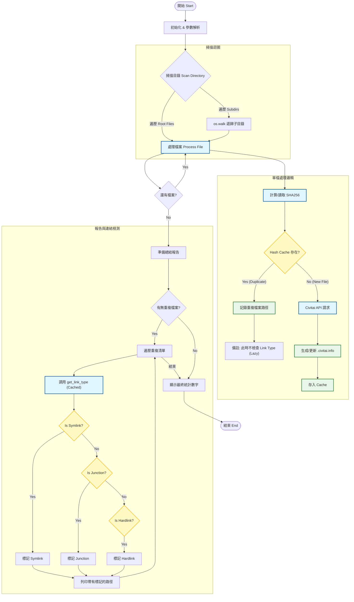

# Civitai Model Scanner CLI (`civitai_scanner.py`)

## 📖 簡介 (Introduction)

`civitai_scanner.py` 是一個獨立運行的命令行與工具 (CLI)，基於 `Stable-Diffusion-Webui-Civitai-Helper` 的核心邏輯。它的主要功能是掃描指定的模型目錄，自動生成或更新 `.civitai.info` 元數據文件，並檢查重複檔案。

### ✨ 核心功能 (Key Features)

*   **獨立運行**: 不依賴 WebUI，直接在終端機執行。
*   **智能掃描**:
    *   支援 `.safetensors`, `.ckpt`, `.pt` 等模型格式。
    *   自動計算 SHA256 哈希值。
    *   若 metadata 已存在且未強制更新，會跳過 API 請求以節省時間。
*   **高效能重複偵測 (Optimized Duplicate Detection)**:
    *   **Lazy Detection**: 在掃描過程中僅記錄路徑，不進行昂貴的 Link Type 檢查。
    *   **Caching**: 使用 `lru_cache` 緩存文件系統屬性檢查 (`is_junction_or_link`)。
*   **詳細報告**:
    *   最後總結顯示掃描統計 (Processed, Updated, Failed, Duplicates)。
    *   **Link Type 辨識**: 在報告階段才辨識並標註 Symlink (符號連結)、Hardlink (硬連結) 或 Junction (目錄聯接點)。

---

## 🚀 使用方法 (Usage)

在終端機 (Terminal / PowerShell) 中執行：

```bash
python civitai_scanner.py <目標目錄路徑> [options]
```

### 參數說明

*   `<path>`: **(必填)** 要掃描的模型根目錄。
*   `--refetch`: **(選填)** 強制重新從 Civitai API 獲取元數據，即使本地已有 `.info` 文件。
*   `--refetch-only-not-found`: **(選填)** 只針對之前未找到 (Not Found / Skeleton) 的模型重新獲取元數據。這在 Civitai 更新其資料庫後非常有用。

### 範例

```bash
# 基本掃描
python civitai_scanner.py "D:\StableDiffusion\models"

# 強制更新所有元數據
python civitai_scanner.py "D:\StableDiffusion\models" --refetch

# 僅重試之前失敗 (Not Found) 的項目
python civitai_scanner.py "D:\StableDiffusion\models" --refetch-only-not-found
```

---

## 🛠️ 程式架構流程圖 (Logic Flow)

以下流程圖展示了掃描器如何處理檔案、檢測重複項以及延遲解析連結類型。



## 🧩 關鍵函式說明

1.  **`scan_directory(directory)`**: 主入口，負責遍歷目錄結構。
2.  **`process_file(filepath)`**: 核心邏輯。計算 Hash，查詢 API，寫入 Metadata。
3.  **`print_summary(stats)`**: 報告生成器。**關鍵優化點**：連結類型檢測 (`get_link_type`) 被推遲到這裡執行，避免了在掃描每一千個檔案時浪費 I/O 資源。
4.  **`is_junction_or_link(path)`**: Windows 專用的底層檢測函式，使用 `os.lstat` 和 `FILE_ATTRIBUTE_REPARSE_POINT` 來精準區分 Junction 和 Symlink。
