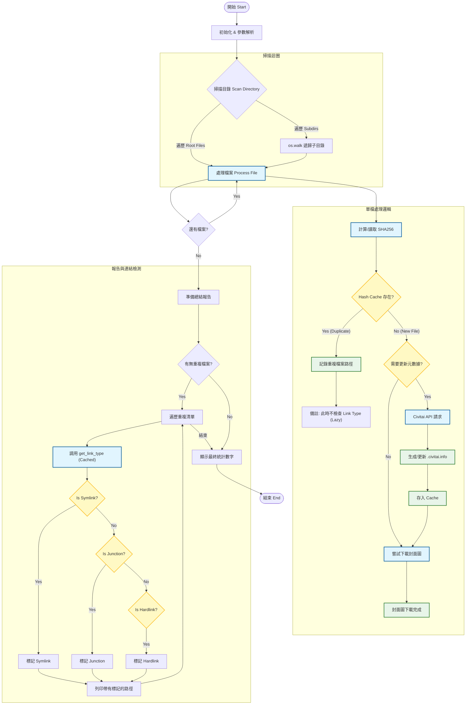

# Civitai Model Tools (Scanner & Reporter)

## 1. Civitai Model Scanner CLI (`civitai_scanner.py`)


## 📖 簡介 (Introduction)

`civitai_scanner.py` 是一個獨立運行的命令行與工具 (CLI)，基於 `Stable-Diffusion-Webui-Civitai-Helper` 的核心邏輯。它的主要功能是掃描指定的模型目錄，自動生成或更新 `.civitai.info` 元數據文件，下載封面預覽圖，並檢查重複檔案。

### ✨ 核心功能 (Key Features)

*   **獨立運行**: 不依賴 WebUI，直接在終端機執行。
*   **智能掃描**:
    *   支援 `.safetensors`, `.ckpt`, `.pt`, `.gguf`, `.bin`, `.zip` 等模型格式。
    *   自動計算 SHA256 哈希值。
    *   若 metadata 已存在且未強制更新，會跳過 API 請求以節省時間。
*   **封面圖下載**:
    *   預設啟用，自動從 Civitai 下載模型的封面預覽圖 (`.preview.png`)。
    *   即使元數據已存在，仍會檢查並下載缺少的封面圖。
    *   可透過 `--no-cover` 停用。
*   **高效能重複偵測 (Optimized Duplicate Detection)**:
    *   **Lazy Detection**: 在掃描過程中僅記錄路徑，不進行昂貴的 Link Type 檢查。
    *   **Caching**: 使用 `lru_cache` 緩存文件系統屬性檢查 (`is_junction_or_link`)。
*   **自訂 API 位址**:
    *   預設使用 `civitai.red` 作為 API 位址。
    *   可透過 `--api-base` 切換至其他實例 (如 `https://civitai.com`)。
*   **詳細報告**:
    *   最後總結顯示掃描統計 (Processed, Updated, Failed, Duplicates, Covers)。
    *   **Link Type 辨識**: 在報告階段才辨識並標註 Symlink (符號連結)、Hardlink (硬連結) 或 Junction (目錄聯接點)。

---

## 🚀 使用方法 (Usage)

在終端機 (Terminal / PowerShell) 中執行：

```bash
python civitai_scanner.py <目標目錄路徑> [options]
```

### 參數說明

*   `<path>`: **(必填)** 要掃描的模型根目錄。
*   `--refetch`: **(選填)** 強制重新從 Civitai API 獲取元數據，即使本地已有 `.info` 文件。
*   `--refetch-only-not-found`: **(選填)** 只針對之前未找到 (Not Found / Skeleton) 的模型重新獲取元數據。這在 Civitai 更新其資料庫後非常有用。
*   `--no-cover`: **(選填)** 停用封面預覽圖下載功能。
*   `--api-base URL`: **(選填)** 指定 Civitai API 基礎位址，預設為 `https://civitai.red`。

### 環境變數 (Environment Variables)

所有參數皆可透過環境變數設定預設值，命令列參數會覆蓋環境變數：

| 環境變數 | 說明 | 預設值 | 範例 |
|----------|------|--------|------|
| `CIVITAI_HELPER_API_BASE` | Civitai API 基礎位址 | `https://civitai.red` | `https://civitai.com` |
| `CIVITAI_HELPER_NO_COVER` | 停用封面圖下載 | `false` | `1`, `true`, `yes` |
| `CIVITAI_HELPER_REFETCH` | 強制重新獲取元數據 | `false` | `1`, `true`, `yes` |
| `CIVITAI_HELPER_REFETCH_ONLY_NOT_FOUND` | 僅重新獲取未找到的模型 | `false` | `1`, `true`, `yes` |

#### 範例

```bash
# 設定環境變數 (Linux/macOS)
export CIVITAI_HELPER_API_BASE="https://civitai.com"
export CIVITAI_HELPER_NO_COVER="1"

# 設定環境變數 (Windows PowerShell)
$env:CIVITAI_HELPER_API_BASE="https://civitai.com"
$env:CIVITAI_HELPER_NO_COVER="1"

# 設定環境變數 (Windows CMD)
set CIVITAI_HELPER_API_BASE=https://civitai.com
set CIVITAI_HELPER_NO_COVER=1

# 使用環境變數的預設值
python civitai_scanner.py "D:\StableDiffusion\models"

# 命令列參數會覆蓋環境變數
python civitai_scanner.py "D:\StableDiffusion\models" --no-cover
```

### 範例

```bash
# 基本掃描 (預設下載封面圖)
python civitai_scanner.py "D:\StableDiffusion\models"

# 強制更新所有元數據
python civitai_scanner.py "D:\StableDiffusion\models" --refetch

# 僅重試之前失敗 (Not Found) 的項目
python civitai_scanner.py "D:\StableDiffusion\models" --refetch-only-not-found

# 使用官網 API 並停用封面下載
python civitai_scanner.py "D:\StableDiffusion\models" --api-base https://civitai.com --no-cover

# 使用批次檔案 (Windows)
civitai_scanner.bat "D:\StableDiffusion\models"
```

---

## 🖼️ 封面圖下載 (Cover Download)

掃描器會自動為每個模型下載封面預覽圖，儲存為 `<模型檔名>.preview.png`。

### 下載邏輯

1. **檢查預覽圖是否存在**: 若 `.preview.png` 已存在則跳過。
2. **從 API 回應獲取圖片**: 使用模型元數據中的 `images` 欄位。
3. **下載第一張圖片**: 自動選擇最大尺寸版本。
4. **獨立於元數據更新**: 即使 `.civitai.info` 已存在且不需要更新，仍會檢查並下載缺少的封面圖。

### 範例輸出

```
[1] Cover downloaded: TTRPG Dungeon Maps Krea
[2] Cover downloaded: 96Yottea Style for Kroma
[3] Duplicate detected (Same as ...)
```

---

## 🛠️ 程式架構流程圖 (Logic Flow)

以下流程圖展示了掃描器如何處理檔案、檢測重複項以及延遲解析連結類型。



## 🧩 關鍵函式說明

1.  **`scan_directory(directory)`**: 主入口，負責遍歷目錄結構。
2.  **`process_file(filepath)`**: 核心邏輯。計算 Hash，查詢 API，寫入 Metadata，下載封面圖。
3.  **`try_download_cover()`**: 統一的封面圖下載邏輯，處理從檔案或 API 回應獲取資訊並下載。
4.  **`download_cover_image()`**: 底層下載函式，處理 HTTP 請求與檔案寫入。
5.  **`print_summary(stats)`**: 報告生成器。**關鍵優化點**：連結類型檢測 (`get_link_type`) 被推遲到這裡執行，避免了在掃描每一千個檔案時浪費 I/O 資源。
6.  **`is_junction_or_link(path)`**: Windows 專用的底層檢測函式，使用 `os.lstat` 和 `FILE_ATTRIBUTE_REPARSE_POINT` 來精準區分 Junction 和 Symlink。

---

## 2. Civitai Model Report Generator (`civitai_report.py`)

### 📖 簡介 (Introduction)

`civitai_report.py` 是一個用於將 `civitai_scanner.py` 產生的 `.civitai.info` 文件整合為一份視覺化 Markdown 報告的工具。它可以幫助你快速概覽所擁有的模型、其觸發詞 (Trigger Words) 以及對應的 Civitai 連結。

### ✨ 核心功能 (Key Features)

*   **自動分組**: 根據模型類型 (Checkpoint, LORA, VAE 等) 自動進行分類。
*   **元數據呈現**: 顯示模型版本、基礎模型 (Base Model)、標籤 (Tags) 與觸發詞。
*   **導覽連結**: 自動生成指向 Civitai 模型頁面的連結。
*   **狀態標記**: 明確標出僅存在於本地、未在 Civitai 上找到的項目 (Not Found / Skeleton)。

### 🚀 使用方法 (Usage)

```bash
python civitai_report.py <目標目錄路徑> [options]
```

#### 參數說明

*   `<path>`: **(必填)** 包含 `.civitai.info` 文件的模型根目錄。
*   `-o`, `--output`: **(選填)** 報告輸出的文件名，預設為 `CIVITAI_MODELS_REPORT.md`。

### 範例

```bash
# 在目前的目錄生成報告
python civitai_report.py "D:\StableDiffusion\models"

# 指定輸出文件名
python civitai_report.py "D:\StableDiffusion\models" -o "MY_MODELS.md"
```

